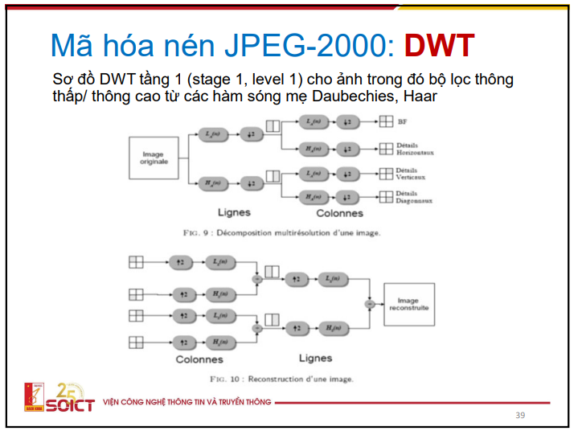

## Mã hóa nén dùng phép biến đổi dựa trên cơ sở lý thuyết nào, có kết hợp các phương pháp gì? Tại sao phương pháp TC này hiện nay được dùng nhiều trong chuẩn nén dữ liệu ảnh/video, audio? Tại sao TC có thể đạt tỷ số nén cao và làm thế nào để hiệu chỉnh hiệu năng nén?

*Mã hóa nén dùng phép biến đổi dựa trên cơ sở lý thuyết nào, có kết hợp các phương pháp gì*

- Khối biến đổi (Transform)

Phép biến đổi Cosine rời rạc (DCT) và Phép biến đổi Wavelet (DWT) 

- Khối lượng tử hóa (Quantization)

- Khối mã hóa ()

Mã hóa số học, mã hóa Huffman,... có đặc điểm trung là mã hóa VLC - độ dài từ mã của mỗi tín hiệu đầu vào sau khi mã hóa là khác nhau

Các chuẩn sử dụng JPEG2000, MP3, MPEG,...

Bỏ sơ đồ DWT và JPEG2000, chỉ cần hiểu khai niệm phần 1,2

*Tại sao TC có thể đạt tỷ số nén cao và làm thế nào để hiệu chỉnh hiệu năng nén*

- Khối T: Tín hiệu đầu vào qua khối T được biến đổi. Khối này sẽ quyết định  tỉ số nén cao
- Khối Q Khối gây sai số, cho phép điều chỉnh tỉ số nén
- Khối E:

## Tại sao DCT được sử dụng rất nhiều trong các chuẩn nén

Do đây là phép biến đổi trên miền tần số

*Thành phần DC của DCT là gì và tại sao dùng DPCM mã hóa các DC của các khối điểm ảnh?*

## Phép biến đổi DWT: Tóm tắt cơ sở lý thuyết, sơ đồ và thuật toán thực hiện DWT cho ảnh 2D/ video

Chỉ cần tóm tắt phép biến đổi DWT và cách triển khai thực hiện nó

Khái niệm phép biến đổi DWT: Phân tích tín hiệu và triển khai trên miền tần số, Fourier - hàm sin & cos, DCT - hàm cos, DWT - các hàm sóng con của sóng mẹ, phân tích hệ số hàm sóng mẹ thành các hàm sóng con

Thực hiện phân tích 

5.5 Không bỏ

Sơ đồ khối
Bao gồm 2 nhánh mã hóa, giải mã, bao gồm các khối lớn

Sơ đồ thuật toán

5.6

Nêu các tóm tắt đặc điểm về lý thuyết về công nghệ và về hiệu năng nén ảnh JPEG2000
Trang đầu và trang cuối slide
Nhờ phép biến đổi wavelet DWT: mạnh về hiệu năng, phức tạp, độ mở (về lý thuyết và cách triển khai cài đặt: số lượng sóng mẹ, các tầng) lớn, tùy tình huống mà có các chuẩn khác nhau → khó thương mại, có thống nhất chuẩn

Trình bày sơ đồ khối tổng quan của bộ CODEC

Tiền xử lý
Biến đổi đơn thành phần và liên thành phần

Multi-component: Các thành phần màu RGB
Phép biến đổi wavelet là biến đổi cho từng tín hiệu trên miền tần số
Thông thường Chia đều các điểm ảnh thành các khổi vừa đủ (8x8)
Multi-component transformation là quá trình chuyển RGB sang YUV (phải kết hợp 3 thành phần RGB để ra từng thành phần YUV, có công thức) 

Bỏ 2 sơ đồ cuối JPEG và DWT
