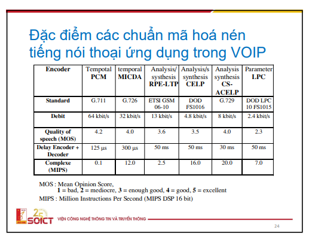

## Tại sao mã hóa âm thanh có 2 cách tiếp cận và 2 họ chuẩn riêng (chuẩn ITU-T và MPEG)? Tín hiệu và định dạng audio khác với tín hiệu và định dạng ảnh/video như thế nào?

2 dạng có 2 dải tần khác nhau, tần số lấy mẫu khác nhau
2 cách lượng tử hóa khác nhau
1 cái dùng cảm nhận âm thanh
- Tiếng nói có dải tần 4KHz
- Âm thanh dải rộng có hiệu ứng che âm, dải tần lớn hơn có người nghe tốt, nghe không tốt

Ngưỡng che được phân tích từ tiếng nói

Do mục đích
- ITU-T: tín hiệu audio thoại, cần truyền nhanh và âm thanh chính xác
- MPEG: Chuẩn nén và mã hóa cho giải trí

## Tại sao mã hóa ITU-T có liên quan đến mã hóa dự đoán

DPCM dự đoán theo từng mẫu, nếu các giá trị mẫu có các mối quan hệ gần nhau thì giá trị sai số dự đoán thấp → phù hợp với dữ liệu tiếng nói

DC của JPEG lại dùng DPCM

6.2.3

6.4
Quy định tần số của tín hiệu số hóa đầu vào cho bộ nén
Chấp nhận sai số vừa phải, để giảm độ phức tạp

Mã hóa âm thanh stereo
Chương 1 tốc độ dữ liệu
