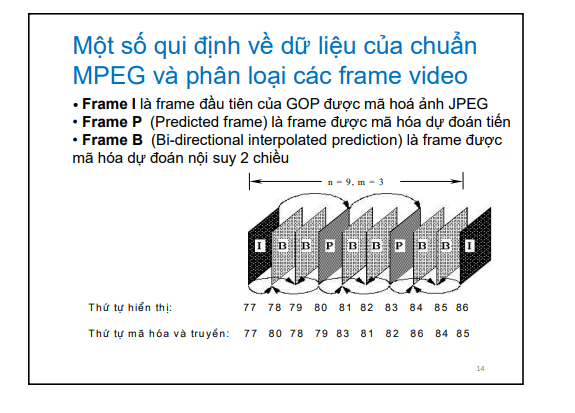
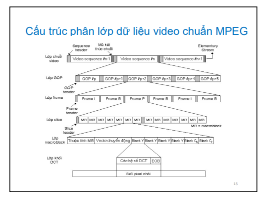
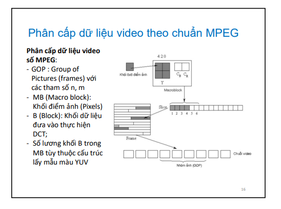
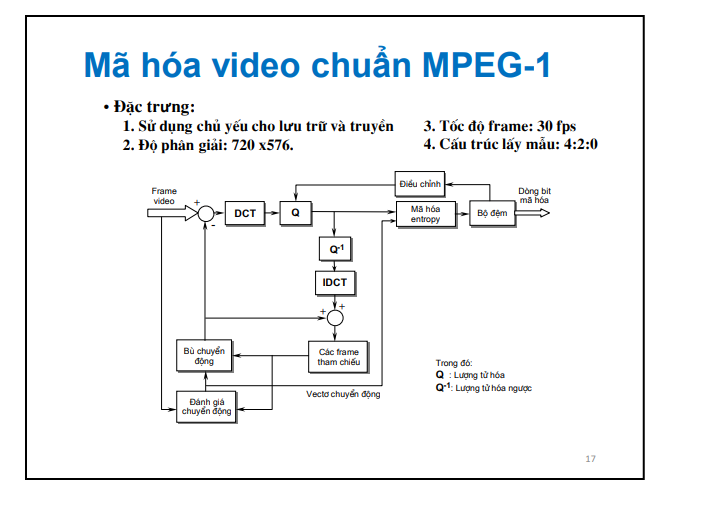

*Lưu ý*
VQ ý nghĩa

Thuật toán DPCM dùng bộ lọc dự đoán, là cơ sở cho ADPCM cho âm thanh
Thuật toán JPEG cho ảnh
Thuật toán MPEG1 cho audio tiếng nói

Hỏi về luồng hoạt động, tính năng, tác dụng

7.1
Hệ màu YUV cho độ phức tạp thấp
Cảm nhận tốt hơn, dù có sai số

7.2

7.3

7.4
Mã hóa Intraframe coding theo sơ đồ MPEG-1

Frame I mã hóa theo intra-frame, cần xác định tham số GOP để xác định frame đầu tiên
Frame B và P mã hóa theo inter-frame

Mã hóa intra-frame được thực ở nhanh ngang trên cùng
Nhánh ở dưới mã hóa interframe

Video player MPEG-1 định dạng 352x240 30fps
RGB bitrate sau nén video 1,2Mpbs
Biết GOP: n = 9, m = 3

? Tính tỉ số nén video MPEG-1 về tốc độ dữ liệu

8 * 3 * 352 * 240 * 30 / 1,2

? Nếu thay đổi tham số GOP thì hiệu năng nén thay đổi thế nào trong các trường hợp sau (tăng hay giảm):
- n = 7, m = 2
- n = 5, m = 1, không có B, chỉ có P
- m = 0 → không có mã hóa interframe trở về MPEG

7.5 Ước lượng chuyển động và ước lượng bù chuyển động

7.6